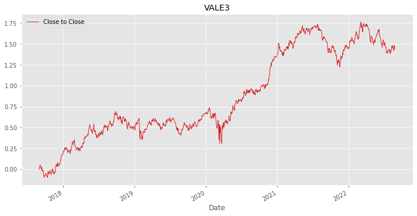
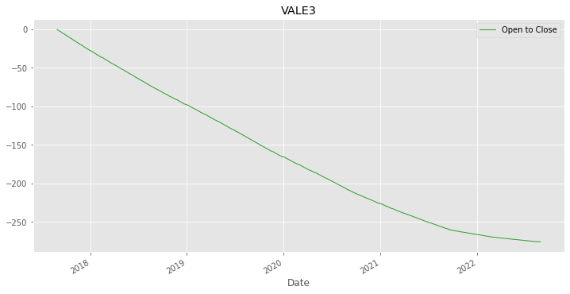
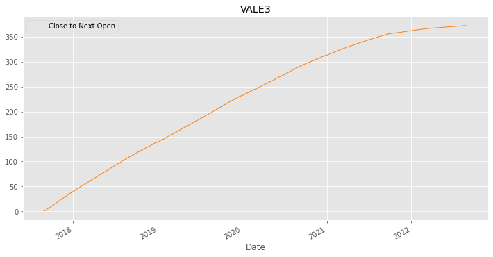
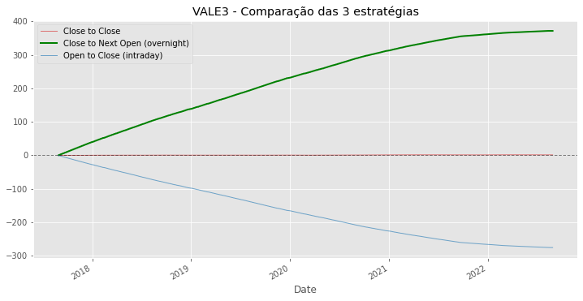
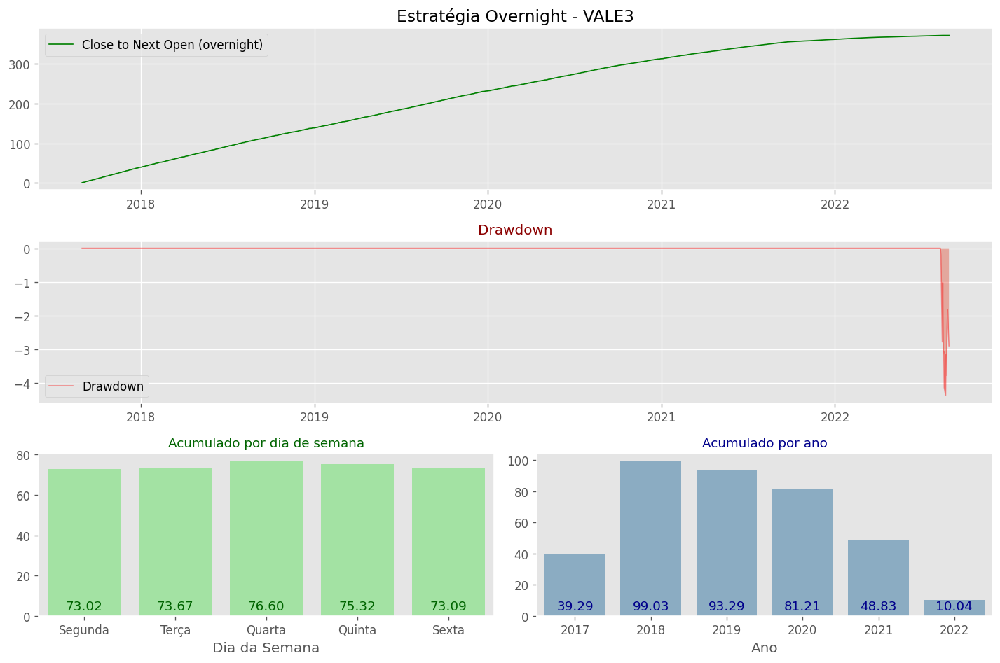

# Estratégia Overnight

Neste notebook foi realizado uma simples comparação entre 3 estratégias e feito alguns gráficos para mostrar os resultados obtidos.

## Estratégia Beaseada em Fechamentos
* O ativo é comprado próximo do fechamento da sessão e a posição é encerrada próximo do fechamento do dia seguinte.

## Estratégia Baseada em Abertura e Fechamento (intraday)
* O ativo é comprado na abertura da sessão e a posição é encerrada próximo ao fechamento da sessão.

## Estratégia Baseada no Fechamento e Abertura do dia seguinte (overnight)
* O ativo é comprado próximo ao fechamento do dia e a posição é encerrada na abertura do dia seguinte.

Agora podemos ver um comparativo entre as 3 estratégias:

E por fim, trago um gráfico com alguns dados sobre a estratégia Overnight:

